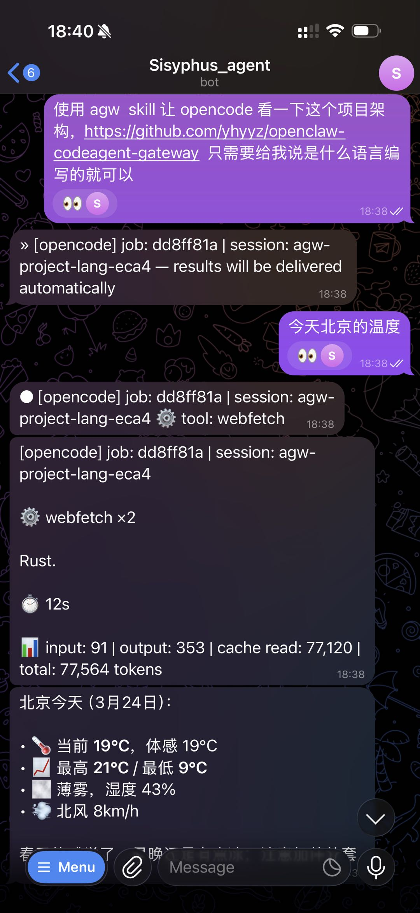

<div align="center">

# ⚡ openclaw-codeagent-gateway

**多租户 AI 编码 Agent HTTP 网关 (OpenClaw)**

---

*通过 Telegram、飞书、Discord 远程调用 Kiro、Claude Code、OpenCode —— 异步执行、Session 复用、实时进度推送。*

一个 Rust 构建的多租户 HTTP 网关，将本地 CLI AI 编码 Agent 通过 ACP 协议暴露为 HTTP API，支持异步任务执行、Session 持久化和渠道无关的 Webhook 回调。

[](https://github.com/yhyyz/openclaw-codeagent-gateway)
[](https://www.rust-lang.org/)
[](LICENSE)
[]()

[English](README.md) | [中文](README.zh-CN.md)

</div>

## 演示



> Telegram 集成：异步任务提交、实时工具进度推送、Session 管理和 Token 消耗报告。

## 核心特性

- **异步即发即忘** — 通过 `POST /jobs` 提交任务，结果通过 Webhook 自动推送。无需轮询，不阻塞会话。
- **Session 持久化与复用** — Agent 进程跨 prompt 存活，相同 Session = 相同上下文。进程重启后 session/load 自动恢复上下文。
- **实时进度追踪** — 工具调用和执行计划实时推送到你的聊天窗口。
- **渠道无关回调** — 适配任何消息平台（Telegram、Discord、Slack、飞书）。网关不关心也不需要知道具体渠道。
- **多租户 5 维策略引擎** — Agent 访问、操作权限、资源隔离、配额限制、回调限制，全部按租户独立配置。
- **Token 消耗报告** — 每个任务报告 input/output/cache read/cache write tokens + 费用（Claude Code 完整分类，OpenCode 总量）。
- **进程池自动恢复** — Agent 子进程由进程池管理。崩溃检测、自动重建、空闲超时清理。
- **人类可读的 Session 命名** — Session 按任务内容命名（如 `auth-refactor-a1b2`），可按名称恢复。
- **消息自动分片** — 超长结果自动拆分，适配 Telegram 4096 字符限制。
- **SQLite 持久化** — 任务和 Session 在网关重启后存活。WAL 模式支持并发访问。
- **单二进制零依赖** — 一个 8MB 的 Rust 二进制文件，无运行时、无 VM、无 node_modules。

> **平台要求**：仅支持 Linux x86_64（预编译二进制）。其他平台可通过 `cargo build --release` 从源码构建。

## 快速开始

### 方式 A：通过 Skill 安装（推荐 OpenClaw 用户使用）

将 openclaw-codeagent-gateway skill 安装到你的 AI 编码 Agent。Skill 包含服务器安装说明，Agent 可以自动执行安装。

```bash
# 安装 skill 到 OpenClaw
npx skills add yhyyz/openclaw-codeagent-gateway -a openclaw -g

# 然后向你的 OpenClaw 机器人发送："安装并配置 agent gateway 服务器"
# Agent 会读取 skill 并在同一台机器上完成所有配置。
```

### 方式 B：直接安装（适用于任何环境）

将此 README 交给 Claude Code、OpenCode 或任何 AI 编码 Agent：

```bash
# Agent 会读取此 README 并：
# 1. 从 GitHub releases 下载预编译二进制
# 2. 从模板创建 gateway.yaml
# 3. 配置 agents 和 tenants
# 4. 设置 systemd 服务
# 5. 启动服务器
```

或手动安装：

```bash
# 下载预编译二进制（Linux x86_64）
curl -LO https://github.com/yhyyz/openclaw-codeagent-gateway/releases/download/v0.1.0/agw-linux-x86_64.tar.gz
tar xzf agw-linux-x86_64.tar.gz
chmod +x agw-linux-x86_64
sudo mv agw-linux-x86_64 /usr/local/bin/agw

# 或从源码构建
git clone https://github.com/yhyyz/openclaw-codeagent-gateway.git
cd openclaw-codeagent-gateway
cargo build --release
# 二进制文件：target/release/agw
```

### 前置条件

#### 必需：至少安装一个 AI 编码 Agent

网关将请求代理到 CLI AI Agent，使用前必须至少安装一个。

| Agent | 安装命令 | 验证 |
|-------|---------|------|
| **OpenCode** | `npm install -g opencode-ai` | `opencode --version` |
| **Claude Code** | `npm install -g @anthropic-ai/claude-code` | `claude --version` |
| **Kiro** | 参见 [kiro.dev/docs/cli](https://kiro.dev/docs/cli) | `kiro-cli --version` |

> **注意**：不需要安装全部三个 — 只安装你需要的 Agent，在 `gateway.yaml` 中将其他 Agent 设为 `enabled: false` 即可。

#### ACP 适配器

部分 Agent 需要 ACP 协议适配器：

| Agent | ACP 命令 | 适配器 |
|-------|---------|--------|
| OpenCode | `opencode acp` | 内置（无需额外安装） |
| Claude Code | `npx -y @zed-industries/claude-agent-acp` | 首次使用时通过 npx 自动下载 |
| Kiro | `kiro-cli acp -a` | 内置（无需额外安装） |

#### 验证 Agent 是否正常工作

启动网关前，测试每个 Agent 的 ACP 模式：

```bash
# OpenCode
echo '{"jsonrpc":"2.0","id":1,"method":"initialize","params":{"protocolVersion":1,"clientCapabilities":{},"clientInfo":{"name":"test","version":"0.1.0"}}}' | opencode acp

# Claude Code（首次运行会下载适配器）
echo '{"jsonrpc":"2.0","id":1,"method":"initialize","params":{"protocolVersion":1,"clientCapabilities":{},"clientInfo":{"name":"test","version":"0.1.0"}}}' | npx -y @zed-industries/claude-agent-acp

# Kiro
echo '{"jsonrpc":"2.0","id":1,"method":"initialize","params":{"protocolVersion":1,"clientCapabilities":{},"clientInfo":{"name":"test","version":"0.1.0"}}}' | kiro-cli acp -a
```

每个 Agent 应返回包含 `"result"` 和 `"agentInfo"` 的 JSON 响应。如果提示 `command not found`，请先安装对应 Agent。

### 运行

```bash
cp gateway.yaml.example gateway.yaml
# 编辑 gateway.yaml（设置 token、agent 路径）
agw serve --config gateway.yaml
```

### CLI 选项

| 参数 | 说明 | 默认值 |
|------|------|--------|
| `--config <path>` | YAML 配置文件路径 | `gateway.yaml` |
| `--host <addr>` | 覆盖 `server.host` | 来自配置文件 |
| `--port <port>` | 覆盖 `server.port` | 来自配置文件 |
| `--verbose` | 强制日志级别为 `debug` | 关闭 |

### 验证

```bash
curl http://localhost:8001/health
# {"status":"ok","version":"0.1.0","uptime_secs":5}
```

## 安装 Skill

openclaw-codeagent-gateway skill 可让任何 AI 编码 Agent 与运行中的网关交互。

### 通过 npx skills（推荐）

```bash
# 安装到所有已检测到的 Agent
npx skills add yhyyz/openclaw-codeagent-gateway

# 安装到特定 Agent
npx skills add yhyyz/openclaw-codeagent-gateway -a openclaw -a claude-code -a opencode

# 全局安装（所有项目可用）
npx skills add yhyyz/openclaw-codeagent-gateway -g -a openclaw
```

### 手动安装

```bash
# OpenClaw
cp -r skill/ ~/clawd/skills/openclaw-codeagent-gateway/

# Claude Code
cp -r skill/ ~/.claude/skills/openclaw-codeagent-gateway/

# OpenCode
cp -r skill/ ~/.config/opencode/skills/openclaw-codeagent-gateway/

# Kiro CLI
cp -r skill/ ~/.kiro/skills/openclaw-codeagent-gateway/
```

安装后，重启 Agent 或开启新 Session 以发现该 Skill。

## 架构

### 完整请求流程

```
用户（Telegram / 飞书 / Discord / Slack）
    │
    │ 1. 用户发送消息
    ▼
┌──────────────────┐
│    OpenClaw       │  消息网关（多渠道）
│    Gateway        │
│    :18789         │
└────────┬─────────┘
         │ 2. AI 读取 openclaw-codeagent-gateway skill
         │ 3. AI 调用 POST /jobs（带 callback）
         ▼
┌──────────────────────────────────────────────────┐
│              openclaw-codeagent-gateway            │
│              (agw :8001)                          │
│                                                    │
│  ┌─────────┐  ┌──────────┐  ┌─────────────────┐  │
│  │  认证    │→│  策略     │→│  任务调度器      │  │
│  │  层      │  │  引擎     │  │                 │  │
│  │          │  │ 5 维     │  │ SQLite + 巡逻   │  │
│  │ Token→   │  │ 检查     │  │ 卡住检测        │  │
│  │ 租户     │  │          │  │ webhook 重试    │  │
│  └─────────┘  └──────────┘  └────────┬────────┘  │
│                                       │            │
│                              ┌────────▼────────┐  │
│                              │  进程池          │  │
│                              │                  │  │
│                              │ (agent,session)  │  │
│                              │  → 复用进程      │  │
│                              │  session/load    │  │
│                              └────────┬────────┘  │
│                                       │            │
└───────────────────────────────────────┼────────────┘
         │                              │ 4. ACP 协议
         │                              │    (JSON-RPC over stdio)
         │                    ┌─────────┼─────────┐
         │                    ▼         ▼         ▼
         │                 kiro-cli  claude-acp  opencode
         │                  (ACP)     (ACP)      (ACP)
         │                    │         │         │
         │                    └────┬────┘─────────┘
         │                         │
         │                         │ 5. Agent 执行任务
         │                         │    （调用 LLM、读取文件、
         │                         │     运行工具、编写代码）
         │                         │
         │                    ┌────▼────────────────┐
         │                    │  进度事件            │
         │                    │  tool_call → webhook │
         │                    │  plan → webhook      │
         │                    └────┬────────────────┘
         │                         │
         │  6. 进度 webhook        │ 7. 最终结果 webhook
         │◄────────────────────────┤◄──────────────────
         │  POST /tools/invoke     │  POST /tools/invoke
         │  ● [agent] ⚙️ tool      │  [agent] 结果 + tokens
         ▼                         ▼
┌──────────────────┐
│    OpenClaw       │  路由到发起消息的渠道
│    Gateway        │
└────────┬─────────┘
         │ 8. 推送到用户聊天
         ▼
用户收到进度 + 最终结果
```

### Session 生命周期

```
首次 prompt（新话题）：
  POST /jobs {new_session:true, session_name:"auth-refactor"}
  → session/new → 创建 ACP session
  → session 存储到 SQLite（含 acp_session_id）

下一次 prompt（同一话题）：
  POST /jobs {session_name:"auth-refactor-a1b2"}
  → 在 SQLite 中查找 session → 找到
  → 进程存活？ → 直接 session/prompt（即时响应）
  → 进程已死？ → 启动新进程 → session/load（恢复上下文） → prompt

空闲超时后（默认 12 小时）：
  → 进程被 watchdog 终止
  → session 记录保留在 SQLite 中
  → 下次 prompt：启动新进程 → session/load → 从 agent 存储恢复上下文

新话题：
  POST /jobs {new_session:true, session_name:"disk-check"}
  → 创建全新 session，无旧上下文
```

### 关键设计决策

- **纯异步执行**：所有任务通过 `POST /jobs` 提交，结果通过 webhook 回调推送。不阻塞上游 session。
- **渠道无关回调**：网关发送 `{channel, target, message}` — 不感知 Discord/Telegram/Slack。上游平台（如 OpenClaw）负责路由。
- **即发即忘模式**：提交任务 → 获取 `job_id` → 结果自动推送。无需轮询。
- **进度 webhook**：工具调用启动和执行计划在执行过程中实时推送给调用方。
- **进程池复用**：相同的 `(agent, session_id)` 复用同一子进程 — 上下文跨轮次保持。
- **多租户**：每个 token 映射到一个租户，具有 5 维策略（agents、operations、resources、quotas、callbacks）。

## 部署

**openclaw-codeagent-gateway 是一个独立服务。** 它不需要和 OpenClaw 或任何客户端部署在同一台机器上。任何 HTTP 客户端都可以远程调用它——OpenClaw、自定义脚本、CI/CD 流水线或其他 AI Agent。

多租户支持正是为此设计的：多个团队、多个 OpenClaw 实例或多个客户端可以共享同一个网关，各自使用独立的 Token 和隔离的权限。

### 部署拓扑

```
Topology A: Co-located (dev/test)
┌──────────────────────────────────┐
│         Single Machine           │
│  OpenClaw + agw + agents         │
│  localhost:18789  localhost:8001  │
└──────────────────────────────────┘

Topology B: Separated (production recommended)
┌────────────────┐         ┌──────────────────────┐
│  Machine A      │  HTTP   │  Machine B            │
│  OpenClaw       │────────→│  agw + agents         │
│  :18789         │         │  :8001                │
│                 │←────────│  (webhook callback)   │
└────────────────┘         └──────────────────────┘

Topology C: Multi-tenant (team scale)
┌──────────────┐
│ Team A       │──┐
│ OpenClaw     │  │
└──────────────┘  │       ┌──────────────────────┐
                  ├──────→│  Shared agw           │
┌──────────────┐  │       │  Machine B            │
│ Team B       │──┤       │  :8001                │
│ OpenClaw     │  │       │                       │
└──────────────┘  │       │  Tenant A: token-aaa  │
                  │       │  Tenant B: token-bbb  │
┌──────────────┐  │       │  Tenant C: token-ccc  │
│ Team C       │──┘       │                       │
│ CI/CD script │          └──────────────────────┘
└──────────────┘
```

### Docker 部署

在远程机器上部署的最快方式：

```bash
# 克隆仓库
git clone https://github.com/yhyyz/openclaw-codeagent-gateway.git
cd openclaw-codeagent-gateway

# 创建配置
cp gateway.yaml.example gateway.yaml
# 编辑 gateway.yaml — 设置 token、回调 URL、working_dir 为 /workspace

# 构建并启动
docker compose up -d

# 验证
curl http://localhost:8001/health
```

或下载预编译二进制，不使用 Docker 运行：

```bash
curl -LO https://github.com/yhyyz/openclaw-codeagent-gateway/releases/download/v0.1.0/agw-linux-x86_64.tar.gz
tar xzf agw-linux-x86_64.tar.gz
sudo mv agw-linux-x86_64 /usr/local/bin/agw
agw serve --config gateway.yaml
```

### Docker Compose 与 OpenClaw 联合部署

在同一台机器上运行完整堆栈：

```yaml
version: "3.8"
services:
  openclaw:
    image: your-openclaw-image
    ports:
      - "18789:18789"
    environment:
      - OPENCLAW_GATEWAY_PASSWORD=your-password
    depends_on:
      agw:
        condition: service_healthy

  agw:
    build: .
    ports:
      - "8001:8001"
    volumes:
      - ./gateway.yaml:/etc/agw/gateway.yaml:ro
      - agw-data:/data
      - agw-workspace:/workspace
    environment:
      - AGW_TOKEN=your-secret-token
      - OPENCLAW_GATEWAY_PASSWORD=your-password

volumes:
  agw-data:
  agw-workspace:
```

### 远程部署检查清单

将 agw 部署在与 OpenClaw 不同的机器上时：

1. **网络**：OpenClaw 必须能够访问 `agw-host:8001`（HTTP）
2. **回调**：agw 必须能够访问 `openclaw-host:18789`（HTTP）以投递 webhook
3. **防火墙**：双向开放端口 8001（agw）和 18789（OpenClaw）
4. **配置**：在 `gateway.yaml` 中，将 `callback.default_url` 设置为 `http://openclaw-host:18789/tools/invoke`
5. **TLS**：对于公网部署，将两者都放在支持 HTTPS 的反向代理后面
6. **Agent**：CLI Agent（opencode、claude、kiro）必须安装在 agw 机器上，而非 OpenClaw 机器上

## 配置

### 最小化 gateway.yaml

```yaml
server:
  host: "0.0.0.0"
  port: 8001

agents:
  claude:
    enabled: true
    mode: acp
    command: "npx"
    acp_args: ["-y", "@zed-industries/claude-agent-acp"]
    working_dir: "/path/to/your/workspace"
    env: {}

  opencode:
    enabled: true
    mode: acp
    command: "opencode"
    acp_args: ["acp"]
    working_dir: "/path/to/your/workspace"
    env: {}

  kiro:
    enabled: true
    mode: acp
    command: "kiro-cli"
    acp_args: ["acp", "-a"]
    working_dir: "/path/to/your/workspace"
    env: {}

pool:
  max_processes: 20
  max_per_agent: 10
  idle_timeout_secs: 43200
  watchdog_interval_secs: 300
  stuck_timeout_secs: 172800

store:
  path: "data/gateway.db"
  job_retention_secs: 86400

callback:
  default_url: ""
  default_token: ""
  retry_max: 3
  retry_base_delay_secs: 5

observability:
  log_level: "info"
  log_format: "json"

gateway:
  allowed_ips: []

tenants:
  default:
    credentials:
      - token: "your-secret-token"
    policy:
      agents:
        allow: ["*"]
      operations:
        async_jobs: true
        session_manage: true
        admin: true
      quotas:
        max_concurrent_sessions: 10
        max_concurrent_jobs: 5
        max_prompt_length: 65536
        session_ttl_hours: 24
      callbacks:
        allowed_urls: ["*"]
        allowed_channels:
          - channel: "*"
            targets: ["*"]
```

### 环境变量展开

`gateway.yaml` 中的所有字符串值都支持 `${VAR_NAME}` 语法。在 YAML 解析之前，网关会将每个 `${...}` 替换为对应的环境变量值。未定义的变量解析为空字符串。

```yaml
tenants:
  ops:
    credentials:
      - token: "${OPS_TEAM_TOKEN}"
```

### Agent 特别说明

| Agent | 命令 | 参数 | 说明 |
|-------|------|------|------|
| Claude Code | `npx -y @zed-industries/claude-agent-acp` | — | 通过 Zed 的 ACP 适配器。权限自动批准。 |
| OpenCode | `opencode acp` | — | 原生 ACP 支持。 |
| Kiro | `kiro-cli acp -a` | `-a` = 信任所有工具 | 不加 `-a` 时，工具调用需手动批准（headless 模式下会挂起）。启动约需 19 秒（MCP 服务器初始化）。 |
| Codex | `codex exec --full-auto` | PTY 模式 | 设置 `mode: pty`，`pty_args: ["exec", "--full-auto"]`。非 ACP — 一次性执行。实验性。 |

### Token 消耗报告

| Agent | Input/Output | Cache Read/Write | 费用 | 总量 |
|-------|-------------|-----------------|------|------|
| Claude Code | ✅ | ✅ | ✅ | ✅ |
| OpenCode | — | — | ✅ | ✅（仅总量） |
| Kiro | — | — | — | — |

### ACP 模式 vs PTY 模式

| 方面 | ACP (`"acp"`) | PTY (`"pty"`) |
|------|---------------|---------------|
| 进程生命周期 | 长期运行，由进程池管理 | 每次调用一次性执行 |
| 通信方式 | 通过 stdin/stdout 的 JSON-RPC | prompt 作为 CLI 参数传递，捕获 stdout |
| Session 支持 | 是 — 相同 session_id 的调用复用进程 | 否 — 每次调用独立 |
| 参数字段 | `acp_args` | `pty_args` |
| 输出处理 | JSON-RPC 响应解析 | ANSI 转义码剥离 |
| 状态 | 生产环境 | 实验性 |

### 完整配置模式

#### `server` — HTTP 服务器设置

| 字段 | 类型 | 默认值 | 说明 |
|------|------|--------|------|
| `host` | string | `"0.0.0.0"` | 监听地址 |
| `port` | integer | `8001` | 监听端口 |
| `shutdown_timeout_secs` | integer | `30` | 优雅关闭超时（秒） |
| `request_timeout_secs` | integer | `300` | 单请求超时（秒） |

#### `agents` — Agent 定义

| 字段 | 类型 | 默认值 | 必需 | 说明 |
|------|------|--------|------|------|
| `enabled` | boolean | `true` | 否 | 是否启用此 Agent |
| `mode` | string | — | **是** | `"acp"` 或 `"pty"` |
| `command` | string | — | **是** | Agent 可执行文件路径 |
| `acp_args` | list of string | `[]` | 否 | ACP 模式参数 |
| `pty_args` | list of string | `[]` | 否 | PTY 模式参数 |
| `working_dir` | string | `"."` | 否 | Agent 进程工作目录 |
| `description` | string | `""` | 否 | 人类可读描述 |
| `env` | map of string → string | `{}` | 否 | 注入到 Agent 进程的环境变量 |

#### `pool` — 进程池设置

| 字段 | 类型 | 默认值 | 说明 |
|------|------|--------|------|
| `max_processes` | integer | `20` | 全局最大活跃进程数 |
| `max_per_agent` | integer | `10` | 每种 Agent 类型最大进程数 |
| `idle_timeout_secs` | integer | `43200`（12 小时） | Agent 进程在最后一次 prompt 后保持存活的时间。设置较高（12 小时），因为 session/load 可在进程重启后恢复上下文。 |
| `watchdog_interval_secs` | integer | `300`（5 分钟） | 巡逻循环检查卡住/空闲进程的频率。 |
| `stuck_timeout_secs` | integer | `172800`（48 小时） | 单个任务可运行的最长时间，超时后标记为失败。设置较高（48 小时），因为复杂的编码任务可能需要数小时。 |

#### `store` — 持久化存储

| 字段 | 类型 | 默认值 | 说明 |
|------|------|--------|------|
| `path` | string | `"data/gateway.db"` | SQLite 数据库文件路径 |
| `job_retention_secs` | integer | `604800`（7 天） | 已完成任务记录的保留时长 |

#### `callback` — Webhook 设置

| 字段 | 类型 | 默认值 | 说明 |
|------|------|--------|------|
| `default_url` | string | `""` | 默认回调 URL（任务未指定时使用） |
| `default_token` | string | `""` | 回调请求的默认认证 token |
| `retry_max` | integer | `3` | 最大投递重试次数 |
| `retry_base_delay_secs` | integer | `5` | 重试间的基础延迟（指数退避） |

#### `observability` — 日志和指标

| 字段 | 类型 | 默认值 | 说明 |
|------|------|--------|------|
| `log_level` | string | `"info"` | `trace`、`debug`、`info`、`warn`、`error` |
| `log_format` | string | `"json"` | `json` 或 `text` |
| `metrics_enabled` | boolean | `false` | 启用指标收集 |
| `audit_path` | string | `""` | 审计日志文件路径（空 = 禁用） |

#### `gateway` — 网络安全

| 字段 | 类型 | 默认值 | 说明 |
|------|------|--------|------|
| `allowed_ips` | list of string | `[]` | IP 白名单（CIDR 格式）。空 = 允许所有 |
| `rate_limit.requests_per_minute` | integer | — | 设置 `rate_limit` 时必填 |
| `rate_limit.burst` | integer | `10` | 超出每分钟速率的突发容量 |

#### `tenants` — 多租户配置（5 维策略）

**维度 1：`policy.agents`** — Agent 访问

| 字段 | 类型 | 默认值 | 说明 |
|------|------|--------|------|
| `allow` | list of string | — | **必填。** 允许的 Agent 名称。`"*"` = 所有 Agent |
| `deny` | list of string | `[]` | 拒绝的 Agent 名称（优先于 allow） |

**维度 2：`policy.operations`** — 操作权限

| 字段 | 类型 | 默认值 | 说明 |
|------|------|--------|------|
| `async_jobs` | boolean | `false` | 允许 `POST /jobs` |
| `session_manage` | boolean | `false` | 允许 `DELETE /sessions/...` |
| `admin` | boolean | `false` | 允许 `/admin/*` 端点 |

**维度 3：`policy.resources`** — 资源隔离

| 字段 | 类型 | 默认值 | 说明 |
|------|------|--------|------|
| `workspace` | string | `"/tmp/agw-workspaces"` | 租户的工作空间根目录 |
| `env_inject` | map of string → string | `{}` | 注入到 Agent 进程的额外环境变量 |
| `env_deny` | list of string | `[]` | 阻止传递给 Agent 的环境变量名 |

**维度 4：`policy.quotas`** — 速率和资源限制

| 字段 | 类型 | 默认值 | 说明 |
|------|------|--------|------|
| `max_concurrent_sessions` | integer | `5` | 此租户的最大活跃 Session 数 |
| `max_concurrent_jobs` | integer | `10` | 最大活跃异步任务数 |
| `max_prompt_length` | integer | `32768` | 最大 prompt 长度（字符数） |
| `session_ttl_hours` | integer | `24` | Session 存活时间（小时） |

**维度 5：`policy.callbacks`** — 回调限制

| 字段 | 类型 | 默认值 | 说明 |
|------|------|--------|------|
| `allowed_urls` | list of string | `[]` | 允许的回调 URL 模式（`*` 后缀通配符） |
| `allowed_channels[].channel` | string | — | 平台名称（如 `"telegram"`、`"slack"`、`"*"`） |
| `allowed_channels[].targets` | list of string | — | 允许的目标（如 `"#ops-alerts"`、`"*"`） |

### 验证规则

网关在启动时验证配置，以下情况将拒绝启动：

1. `tenants` 为空 — 必须配置至少一个租户
2. 没有 Agent 的 `enabled: true` — 至少需要一个活跃 Agent
3. 任何启用的 Agent 的 `mode` 不是 `"acp"` 或 `"pty"`

## API 参考

### 端点

| 方法 | 路径 | 认证 | 说明 |
|------|------|------|------|
| `GET` | `/health` | 否 | 存活检查 |
| `GET` | `/agents` | Bearer | 列出 Agent（按租户策略过滤） |
| `POST` | `/jobs` | Bearer | 提交异步任务 |
| `GET` | `/jobs` | Bearer | 列出租户的任务 |
| `GET` | `/jobs/{id}` | Bearer | 任务状态 + 进度 + 结果 |
| `DELETE` | `/sessions/{agent}/{sid}` | Bearer | 关闭 Agent Session |
| `GET` | `/health/agents` | Bearer | Agent 进程健康状态 |
| `GET` | `/admin/tenants` | Bearer + admin | 列出租户 |
| `GET` | `/admin/pool` | Bearer + admin | 进程池状态 |

所有需要认证的端点都要求 `Authorization: Bearer <token>` 请求头。
所有错误响应使用 `{"error": "<message>"}` 格式。

### 健康检查

```bash
curl -sf http://localhost:8001/health | jq .
```

```json
{
  "status": "ok",
  "version": "0.1.0",
  "uptime_secs": 12345
}
```

### 列出 Agent

```bash
curl -sf -H "Authorization: Bearer $AGW_TOKEN" http://localhost:8001/agents | jq .
```

```json
{
  "agents": [
    {"name": "claude", "mode": "acp", "description": "Claude Code agent (via ACP adapter)"},
    {"name": "kiro", "mode": "acp", "description": "AWS Kiro coding agent"},
    {"name": "opencode", "mode": "acp", "description": "OpenCode multi-model agent"}
  ]
}
```

### 提交任务

```bash
curl -sf -X POST http://localhost:8001/jobs \
  -H "Authorization: Bearer $AGW_TOKEN" \
  -H "Content-Type: application/json" \
  -d '{
    "agent": "claude",
    "prompt": "Analyze the auth module and suggest improvements",
    "progress_notify": true,
    "callback": {
      "channel": "telegram",
      "target": "tg:1704924315",
      "account_id": "default"
    }
  }' | jq .
```

响应（`202 Accepted`）：

```json
{
  "job_id": "550e8400-e29b-41d4-a716-446655440000",
  "status": "pending",
  "agent": "claude",
  "session_id": "def-456"
}
```

#### 请求字段

| 字段 | 必需 | 默认值 | 说明 |
|------|------|--------|------|
| `agent` | 是 | — | Agent 名称：`claude`、`opencode`、`kiro` |
| `prompt` | 是 | — | 任务描述 |
| `callback` | 是* | — | Webhook 路由（*不提供则结果丢失） |
| `callback.channel` | 否 | `""` | 消息平台标识（如 `telegram`、`slack`） |
| `callback.target` | 否 | `""` | 路由目标（如 `tg:1704924315`、`#ops-alerts`） |
| `callback.account_id` | 否 | `""` | Bot 账户标识 |
| `session_id` | 否 | 自动生成 UUID v4 | 复用以实现多轮对话 |
| `progress_notify` | 否 | `true` | `false` 为静默模式（仅推送最终结果） |

### 任务生命周期

```
pending → running → completed / failed / interrupted
```

| 状态 | 说明 |
|------|------|
| `pending` | 任务已创建，等待 Agent 进程 |
| `running` | Agent 正在处理中 |
| `completed` | Agent 成功完成 |
| `failed` | Agent 返回错误 |
| `interrupted` | 任务被取消或超时（`stuck_timeout_secs`） |

### 获取任务状态

```bash
curl -sf -H "Authorization: Bearer $AGW_TOKEN" \
  http://localhost:8001/jobs/550e8400-e29b-41d4-a716-446655440000 | jq .
```

```json
{
  "id": "550e8400-e29b-41d4-a716-446655440000",
  "agent": "claude",
  "session_id": "sess-abc-123",
  "status": "completed",
  "result": "Refactored auth module: extracted trait, added 12 unit tests...",
  "error": "",
  "tools": ["read_file", "write_file", "run_command"],
  "created_at": 1711234567,
  "completed_at": 1711234600,
  "duration_secs": 33.0
}
```

### 列出任务

```bash
curl -sf -H "Authorization: Bearer $AGW_TOKEN" http://localhost:8001/jobs | jq '.jobs[] | {id, status}'
```

最多返回 100 个任务，按 `created_at` 降序排列。跨租户隔离 — 你只能看到自己的任务。

### 关闭 Session

```bash
curl -sf -X DELETE -H "Authorization: Bearer $AGW_TOKEN" \
  http://localhost:8001/sessions/kiro/sess-abc-123 | jq .
```

```json
{"status": "closed", "agent": "kiro", "session_id": "sess-abc-123"}
```

### 管理端点

需要租户策略中设置 `operations.admin: true`。

```bash
# 列出租户
curl -sf -H "Authorization: Bearer $AGW_TOKEN" http://localhost:8001/admin/tenants | jq .

# 进程池状态
curl -sf -H "Authorization: Bearer $AGW_TOKEN" http://localhost:8001/admin/pool | jq .
```

### 错误参考

| HTTP 状态码 | 错误类型 | 触发条件 |
|------------|---------|---------|
| `401` | Unauthorized | Bearer token 缺失或无效 |
| `403` | Forbidden | Agent 不在允许列表中、操作未授权、回调被拒绝 |
| `404` | Not Found | Agent 已禁用/不存在、任务未找到或跨租户 |
| `422` | Unprocessable Entity | prompt 超过 `max_prompt_length` |
| `429` | Too Many Requests | 配额超限、速率限制、进程池耗尽 |
| `500` | Internal Server Error | Agent 崩溃、I/O 错误、数据库错误 |
| `504` | Gateway Timeout | 请求超过 `request_timeout_secs` |

### 最终结果（通过 webhook 回调）

网关将结果格式化为人类可读的消息并通过回调推送：

```
[Claude] abc12345

🔧 bash ×3 | read_file ×1

分析结果在这里...

⏱ 27s
📊 input: 156 | output: 420 | cache read: 4,349 | cache write: 3,711 | total: 8,636 tokens
💰 $0.0255
```

## OpenClaw 集成

> **注意**：此示例中 agw 和 OpenClaw 在同一台机器上（127.0.0.1）。生产环境中，建议将 agw 部署在独立机器上（专用 CPU/内存给 Agent 进程），并将 127.0.0.1 替换为 agw 机器的 IP 地址。

此配置已经过端到端测试：Telegram → OpenClaw → agw → agent → webhook → OpenClaw → Telegram。

### 第 1 步：OpenClaw 的 gateway.yaml

以下是已验证可工作的配置：

```yaml
# Agent Gateway — 本地配置
# 所有 Agent 继承系统环境变量（无需 API key）

server:
  host: "127.0.0.1"
  port: 8001
  shutdown_timeout_secs: 30
  request_timeout_secs: 600

agents:
  kiro:
    enabled: true
    mode: acp
    command: "kiro-cli"
    acp_args: ["acp", "-a"]
    working_dir: "/path/to/your/workspace"
    description: "AWS Kiro coding agent"
    env: {}

  claude:
    enabled: true
    mode: acp
    command: "npx"
    acp_args: ["-y", "@zed-industries/claude-agent-acp"]
    working_dir: "/path/to/your/workspace"
    description: "Claude Code agent (via ACP adapter)"
    env: {}

  opencode:
    enabled: true
    mode: acp
    command: "opencode"
    acp_args: ["acp"]
    working_dir: "/path/to/your/workspace"
    description: "OpenCode multi-model agent"
    env: {}

pool:
  max_processes: 20
  max_per_agent: 10
  idle_timeout_secs: 43200
  watchdog_interval_secs: 300
  stuck_timeout_secs: 172800

store:
  path: "data/gateway.db"
  job_retention_secs: 86400

callback:
  default_url: "http://127.0.0.1:18789/tools/invoke"
  default_token: "${OPENCLAW_GATEWAY_PASSWORD}"
  retry_max: 3
  retry_base_delay_secs: 5

observability:
  log_level: "info"
  log_format: "json"
  metrics_enabled: false
  audit_path: ""

gateway:
  allowed_ips: []
  rate_limit:
    requests_per_minute: 300
    burst: 10

tenants:
  openclaw:
    credentials:
      - token: "${AGW_TOKEN}"
    policy:
      agents:
        allow: ["*"]
        deny: []
      operations:
        sync_call: true
        stream: true
        async_jobs: true
        session_manage: true
        admin: true
      resources:
        workspace: "/path/to/your/workspace"
        env_inject: {}
        env_deny: []
      quotas:
        max_concurrent_sessions: 10
        max_concurrent_jobs: 5
        max_prompt_length: 65536
        session_ttl_hours: 48
      callbacks:
        allowed_urls:
          - "http://127.0.0.1:18789/tools/invoke"
        allowed_channels:
          - channel: "*"
            targets: ["*"]
```

### 第 2 步：安装 Skill 到 OpenClaw

```bash
# 方式 A：npx skills
npx skills add yhyyz/openclaw-codeagent-gateway -a openclaw -g

# 方式 B：手动安装
cp -r skill/ ~/clawd/skills/openclaw-codeagent-gateway/
chmod +x ~/clawd/skills/openclaw-codeagent-gateway/scripts/agw-client.sh
```

### 第 3 步：启动 agw 服务

```bash
# 作为 systemd 服务
sudo cp agw.service /etc/systemd/system/
sudo systemctl daemon-reload
sudo systemctl enable --now agw

# 或直接运行
agw serve --config gateway.yaml
```

### 第 4 步：重启 OpenClaw 网关

```bash
openclaw gateway restart
```

### 第 5 步：从 Telegram/飞书/Discord 测试

向你的 OpenClaw 机器人发送消息：

```
用 claude 帮我分析一下当前项目的代码结构
```

机器人将：
1. 向 agw 提交任务
2. 立即回复 "✅ 任务已提交"
3. 在 Agent 工作时发送进度更新
4. 发送最终结果和 Token 消耗统计

### systemd 服务文件

示例 systemd 单元文件（根据你的环境调整路径）：

```ini
[Unit]
Description=Agent Gateway (agw)
After=network.target

[Service]
Type=simple
User=<your-user>
WorkingDirectory=<project-dir>
ExecStart=/usr/local/bin/agw serve --config <project-dir>/gateway.yaml
Restart=on-failure
RestartSec=5
Environment="PATH=$HOME/.cargo/bin:$HOME/.npm-global/bin:/usr/local/bin:/usr/bin:/bin"
Environment="HOME=/home/<your-user>"

[Install]
WantedBy=multi-user.target
```

### Webhook 回调格式

agw 发送以下 payload 到 OpenClaw 的 `/tools/invoke`：

```json
{
  "tool": "message",
  "args": {
    "action": "send",
    "channel": "telegram",
    "target": "tg:1704924315",
    "message": "[Claude] abc12345\n\n🔧 bash ×2\n\nResult text...\n\n⏱ 15s\n📊 input: 3 | output: 5 | total: 8,068 tokens\n💰 $0.0255"
  },
  "sessionKey": "main"
}
```

## Session 管理

- **多轮对话**：在不同任务中提供相同的 `session_id` 以保持对话上下文
- **隔离性**：不同的 session ID → 隔离的 Agent 进程
- **自动重建**：如果 Agent 崩溃，网关会自动重建（上下文丢失，用户会收到通知）
- **进程池复用**：相同的 `(agent, session_id)` 复用同一子进程 — 后续消息无冷启动开销

## 故障排查

| 症状 | 原因 | 修复方法 |
|------|------|---------|
| `401 unauthorized` | token 错误 | 检查 gateway.yaml 中的 `tenants.*.credentials` |
| `403 agent not allowed` | Agent 不在允许列表中 | 添加到 `policy.agents.allow` |
| `403 admin required` | 无管理员权限 | 设置 `operations.admin: true` |
| `403 callback URL denied` | 回调 URL 不在白名单中 | 将 URL 添加到 `callbacks.allowed_urls` |
| `403 callback channel denied` | 渠道不被允许 | 添加到 `callbacks.allowed_channels` |
| `404 agent not found` | Agent 已禁用或不存在 | 设置 `agents.*.enabled: true` |
| `422 prompt too long` | prompt 超过最大长度 | 增大 `quotas.max_prompt_length` 或缩短 prompt |
| `429 quota exceeded` | 达到并发限制 | 增大 `quotas.max_concurrent_*` 或等待任务完成 |
| `429 rate limited` | 请求过多 | 增大 `gateway.rate_limit.requests_per_minute` |
| `503 pool exhausted` | Agent 无可用容量 | 等待或增大 `pool.max_per_agent` |
| `504 timeout` | 请求耗时过长 | 增大 `server.request_timeout_secs` |
| 健康检查失败 | 网关未运行 | 检查 `systemctl status agw` 或确认端口 8001 是否在使用 |
| 任务卡在 `running` | Agent 挂起 | `stuck_timeout_secs` 后自动标记失败（默认 48 小时） |
| 未收到回调 | 缺少 callback 字段 | 任务请求中始终包含 `callback` |
| 未收到回调 | OpenClaw 未运行 | 确认 OpenClaw 在端口 18789 上运行 |
| Kiro 启动约需 19 秒 | MCP 服务器初始化 | 正常 — 新 Kiro Session 的首个任务较慢 |
| Agent 进程崩溃 | 崩溃或 OOM | 网关在下次请求时自动重建（上下文丢失） |

## 安全

- **Token 隔离**：每个租户使用自己的 Bearer token 进行认证。Token 是任意字符串 — 可用 `openssl rand -hex 32` 生成。
- **环境变量清除**：Agent 配置中 `env: {}` 意味着 Agent 不继承宿主机的任何环境变量（agw 执行 `env_clear()`）。只有显式列出的变量会传递。
- **工作空间隔离**：每个租户通过 `resources.workspace` 获得隔离的工作空间目录。
- **回调限制**：回调仅投递到租户 `allowed_urls` 列表中的 URL。Channel/target 过滤同样生效。
- **环境变量拒绝列表**：`env_deny` 阻止特定变量（如 `AWS_SECRET_ACCESS_KEY`）传递到 Agent 进程。
- **IP 白名单**：`gateway.allowed_ips` 按源 IP 限制访问（CIDR 格式）。
- **速率限制**：全局速率限制防止滥用（`requests_per_minute` + `burst`）。
- **审计日志**：设置 `observability.audit_path` 后，每个认证决策都会被记录。
- **无凭证泄露**：`GET /admin/tenants` 仅列出租户名称 — 永远不暴露凭证或策略。

## 项目结构

```
src/
├── main.rs           # CLI 入口 (clap) — serve 子命令
├── config.rs         # gateway.yaml 解析 + ${VAR} 展开 + 验证
├── error.rs          # 错误类型 → HTTP 状态码
├── app.rs            # AppState 组装（Arc 共享给所有 handler）
├── lib.rs            # 模块重导出
├── auth/             # 多租户认证 + 5 维策略执行
├── api/              # HTTP handler (axum) + 认证中间件 + 路由
├── runtime/          # ACP/PTY 进程管理 + 进程池 + JSON-RPC
├── scheduler/        # 任务生命周期 + SQLite 存储 + 巡逻循环（watchdog）
├── dispatch/         # Webhook 投递 + 结果格式化 + 重试逻辑
└── observability/    # Tracing 设置 + 指标初始化

skill/                # AI Agent Skill（可安装到 OpenClaw/Claude/OpenCode/Kiro）
├── SKILL.md          # 给 AI Agent 的 Skill 说明
├── scripts/          # agw-client.sh 辅助脚本
└── references/       # API + 配置参考文档

data/
└── gateway.db        # SQLite 数据库（自动创建）
```

## 配置加载流程

```
gateway.yaml
  → 读取原始文本
  → 展开环境变量中的 ${VAR} 引用
  → YAML 反序列化为 GatewayConfig
  → validate_config() 检查不变量
  → CLI --host/--port/--verbose 覆盖应用
  → 构建 TenantRegistry（token → 租户索引）
  → 初始化 ProcessPool、QuotaTracker、JobStore
  → 组装 AppState（Arc 共享给所有 handler）
  → 启动巡逻循环（watchdog + 任务清理器）
  → Axum 服务器启动（支持优雅关闭）
```

## 许可证

MIT
